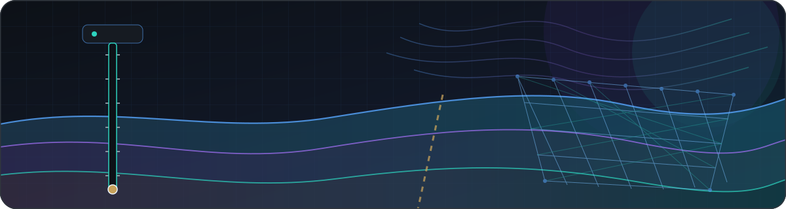
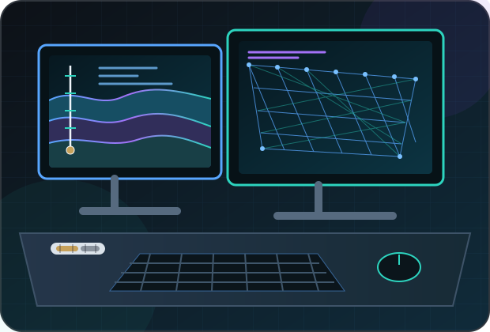

## Hey 👋, I'm BOSSzzy! 

### Glad to see you here!

*I'm BOSSzzy, a geotechnical engineering researcher focused on computational methods for understanding and managing subsurface uncertainty. With a strong interest in approaches that are rigorous yet practical, I explore spatial variability, stochastic modelling, geological inversion, and reproducible scientific workflows.*

## Rapidfire

<table><tr><td valign="top" width="50%">

 

- ***I’ll soon be based at [Beijing University of Technology (BJUT)](https://english.bjut.edu.cn/), Beijing***

- ***I’m currently exploring computational geotechnics, stochastic modelling, and uncertainty quantification***

- ***Ask me anything about random fields, geological inversion, and scientific computing***

- ***I work with Python, MATLAB, R, Fortran, SQL, and Linux***

- ***I enjoy Stardew Valley and connecting with people who share an interest in engineering and research***

- ***Email: [bosszzy0824@gmail.com](mailto:bosszzy0824@gmail.com)***

</td><td valign="top" width="50%">

  

</td></tr></table>

 

## Languages and Tools

  
  
  
  
  &nbsp;&nbsp;<kbd><strong>SQL</strong></kbd>&nbsp;&nbsp;
  
  

 

## GitHub Stats

## Featured Work

**Selected projects at the intersection of geotechnical engineering, uncertainty modelling, and scientific computing.**

- **[Msource_BM](https://github.com/BOSSzzy/Msource_BM)** — Bayesian–Markov multi-source data fusion for geological stochastic inversion. (`Python` · `MATLAB` · `Fortran`)
- **[Cholesky_Midpoint_RF](https://github.com/BOSSzzy/Cholesky_Midpoint_RF)** — Generation and benchmarking of two-dimensional Gaussian random fields on structured grids. (`MATLAB`)

---
